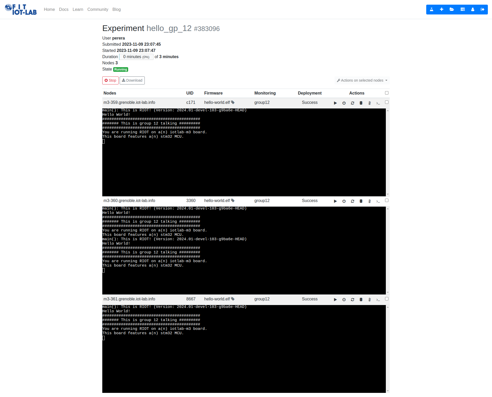

# How to run hello world example

#tutorial

Login to IoT Testbed ssh front end. ([SSH access · FIT IoT-LAB](https://www.iot-lab.info/docs/getting-started/ssh-access/)) 
Next clone the repository

```Bash
git clone https://github.com/KRVPerera/sense.git
cd sense
git submodule update --init
```

Next within the sense folder run the `make hello`. This will create the firmware and schedule three nodes running the firmware. You can access them via web interface. Get a terminal from the web interface and reset the nodes to see the output.


