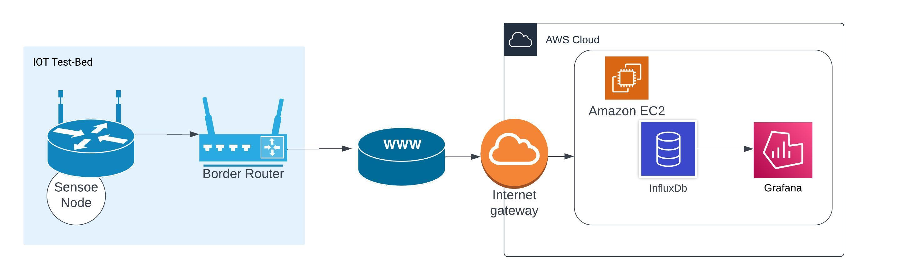

  

<!-- TABLE OF CONTENTS -->

  
Table of Contents

  <ol>
    <li>
      <a href="#about-the-project">About The Project</a>
      <ul>
        <li><a href="#built-with">Built With</a></li>
      </ul>
    </li>
    <li>
      <a href="#getting-started">Getting Started</a>
      <ul>
        <li><a href="#prerequisites">Prerequisites</a></li>
        <li><a href="#installation">Installation</a></li>
      </ul>
    </li>
    <li><a href="#usage">Usage</a></li>
    <li><a href="#roadmap">Roadmap</a></li>
    <li><a href="#contributing">Contributing</a></li>
    <li><a href="#license">License</a></li>
    <li><a href="#contact">Contact</a></li>
    <li><a href="#acknowledgments">Acknowledgments</a></li>
  </ol>

<!-- ABOUT THE PROJECT -->

## About The Project

End to end IOT system which collects sensor data and visualize on cloud

<!-- BUILT WITH -->

## Built With

This section should list any major frameworks/libraries used to bootstrap your project. Leave any add-ons/plugins for the acknowledgements section. Here are a few examples.

* RIOT - Real Time operating system

* [IoT-LAB M3]([IoT-LAB M3 · FIT IoT-LAB](https://www.iot-lab.info/docs/boards/iot-lab-m3/)) MCU boards

* I2C  Protocol

* [CoAP]([Constrained Application Protocol - Wikipedia](https://en.wikipedia.org/wiki/Constrained_Application_Protocol)) - Constrained Application Protocol

* [Grafana](https://grafana.com/)

* [InfluxDB](https://www.influxdata.com/glossary/nosql-database/) - is a time series no sql database designed to handle high write and query loads, primarily used for real-time analytics, monitoring, and IoT applications.

* Amazon EC2
  
  
(<a href="#readme-top">back to top</a>)

### Sensor Layer

More details about sensor layer is here :  [Sensor](./docs/SENSOR,md)

- We using M3 boards pressure sensors built in temperature sensor to read temperature data

- Sensor is setup to temperature resolution configuration 101. To Further reduce noise and increase precision by internal averaging. (AVGT2, AVGT1, ABGT0) - 101

- We use **SMA** (Simple Moving Average) technique to reduce noise in the data

- Data is collected and send in bulk to the server

- Board is in **sleep** mode when not reading the sensor data

- Parity bit is added as extra precaution to recognize corrupted data

                                                                                                                   ([back to top](#readme-top))

## Network Layer

More details about network layer is here : [Network](./docs/NETWORK,md)

- We use CoAP request response style application layer protocol.

- CoAP is a **low overhead** protocol designed for **constrained** network nodes.

- It **Confirmable** mode message communication with server that we use which gets a `ACK` response from the server.

- It provides **re transmission** to mitigate packet loss during transmission. It has a 16 bit message id to help this.

- Runs on UDP protocol reducing overhead on nodes.

- Since it runs on UDP it can intermittently connect and disconnect which by nature of IOT nodes

                                                                                                                   ([back to top](#readme-top))

#### References

[The Constrained Application Protocol (CoAP)](https://datatracker.ietf.org/doc/html/rfc7252)

[Constrained Application Protocol - Wikipedia](https://en.wikipedia.org/wiki/Constrained_Application_Protocol)

[What is CoAP](https://www.radware.com/security/ddos-knowledge-center/ddospedia/coap/)

## Data Layer

More details about sensor layer is here : [Server](./docs/SERVER,md)

- InfluxDB is a TSDB (time series) type NoSQL databse

- Grafana time series

- Parity fail handling by interpolation

- 

                                                                                                                   ([back to top](#readme-top))

##### References

[NoSQL Database | InfluxData](https://www.influxdata.com/glossary/nosql-database/)

   

## Security

- Although we have not focused on this aspect. CoAP protocol it self support secure communication over DTLS by exchanging ECDSA certificates. It is easy to setup.

- For testing purposes we have opened all the source IPv6 addresses in Influx database. but we need to add inbound rules only to allow our CoAP client IPs to reach the server.

- We have made sure only the relevant port for CoAP is open in the server.

- Parity bit serves as data corruption detection. But we can go for CRC like more advance algorithms.

- Data is not encrypted. Even when you use DTLS still from application layer your server and node can decide on a encryption mechanism to secure the data further.

                                                                                                                   ([back to top](#readme-top))