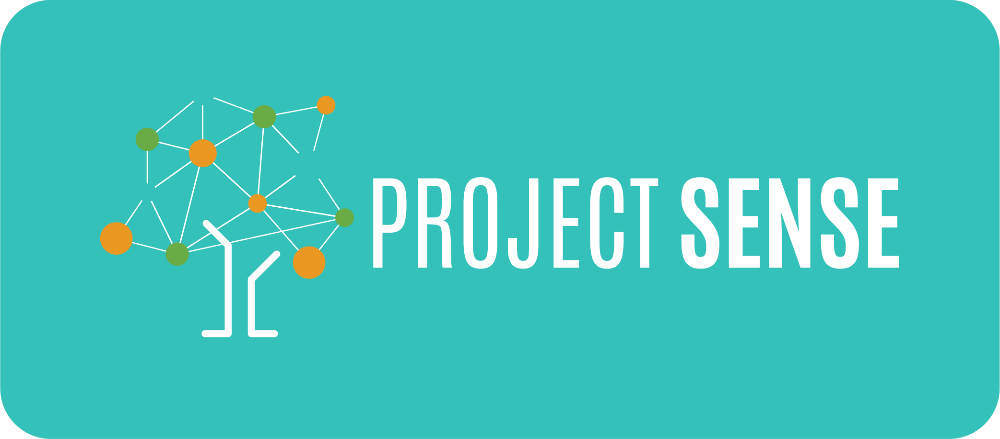

  

## Demo

  

## How to Run

- [Wiki page](https://github.com/KRVPerera/sense/wiki/How-to-run-the-project)

## High Level Architecture

<!-- BUILT WITH -->

## Built With

* [RIOT - Real Time operating system](https://www.riot-os.org/)

* [IoT-LAB M3 · FIT IoT-LAB](https://www.iot-lab.info/docs/boards/iot-lab-m3/) MCU boards

* [I2C Protocol](https://en.wikipedia.org/wiki/I%C2%B2C)

* [CoAP - Constrained Application Protocol](https://en.wikipedia.org/wiki/Constrained_Application_Protocol) - Constrained Application Protocol

* [Grafana](https://grafana.com/)

* [InfluxDB](https://www.influxdata.com/glossary/nosql-database/)

* [Amazon EC2](https://aws.amazon.com/ec2/)

* [Docker](https://www.docker.com/)
  
  
(<a href="#readme-top">back to top</a>)

### Sensor Layer

More details about sensor layer is here :  [docs/Sensor](./docs/SENSOR.md)

- We using M3 boards pressure sensors built in temperature sensor to read temperature data

- Sensor is setup to temperature resolution configuration 101. To Further reduce noise and increase precision by internal averaging. (AVGT2, AVGT1, ABGT0) - 101

- We use **SMA** (Simple Moving Average) technique to reduce noise in the data

- Data is collected and send in bulk to the server

- Board is in **sleep** mode when not reading the sensor data

- Parity bit is added as extra precaution to recognize corrupted data

                                                                                   

(<a href="#readme-top">back to top</a>)

## Network Layer

More details about network layer is here : [docs/Network](./docs/NETWORK.md)

- We use CoAP request response style application layer protocol.

- CoAP is a **low overhead** protocol designed for **constrained** network nodes.

- It has **Confirmable** mode message communication with server that we use which gets a `ACK` response from the server.

- It provides **re transmission** to mitigate packet loss during transmission. It has a 16 bit message id to help this.

- Runs on UDP protocol reducing overhead on nodes.

- Since it runs on UDP it can intermittently connect and disconnect which by nature of IOT nodes                                                                               

#### References

[The Constrained Application Protocol (CoAP)](https://datatracker.ietf.org/doc/html/rfc7252)

[Constrained Application Protocol - Wikipedia](https://en.wikipedia.org/wiki/Constrained_Application_Protocol)

[What is CoAP](https://www.radware.com/security/ddos-knowledge-center/ddospedia/coap/)

(<a href="#readme-top">back to top</a>)

## Data Management Layer

More details about data management layer is here : [docs/Server](./docs/SERVER.md)

- InfluxDB serves as the core Time Series Database (TSDB) in this architecture. It is a NoSQL database optimized for handling time-stamped data efficiently.

- Grafana complements InfluxDB by providing powerful visualization capabilities for time-series data.

- To ensure data integrity, a parity bit is appended to each temperature value during transmission. The EC2 CoAP listener, running as a Docker container, extracts the received data and performs frequent parity checks. 

### Overview of Data Flow
 
1. **Data Ingestion:**
   - CoAP data is ingested into the EC2 instance, where the CoAP listener Docker container captures and extracts the temperature values along with parity bits.
 
2. **Data Storage:**
   - Extracted and verified data, is written into InfluxDB for persistent storage.
 
3. **Data Visualization:**
   - Grafana connects to InfluxDB to fetch time-series data and displays it through customizable dashboards.
 
The integration of InfluxDB and Grafana within the EC2 environment provides a robust foundation for handling, storing, and visualizing time-series data efficiently.

### References

[NoSQL Database - InfluxDB](https://www.influxdata.com/glossary/nosql-database/)

(<a href="#readme-top">back to top</a>)

## Security
 
- Although we have not focused on this aspect. CoAP protocol it self support secure communication over DTLS by exchanging ECDSA certificates. It is an easy to setup.
 
- For testing purposes we have opened all the source IPv6 addresses in EC2 instance. but we need to add inbound rules only to allow our CoAP client IPs to reach the server.
 
- We have made sure only the relevant port for CoAP to open in the server.
 
- Parity bit serves as data corruption detection. But we can go for CRC like more advance algorithms.
 
- Data is not encrypted. Even when you use DTLS still from application layer your server and node can decide on a encryption mechanism to secure the data further.

                                                                                   

(<a href="#readme-top">back to top</a>)

