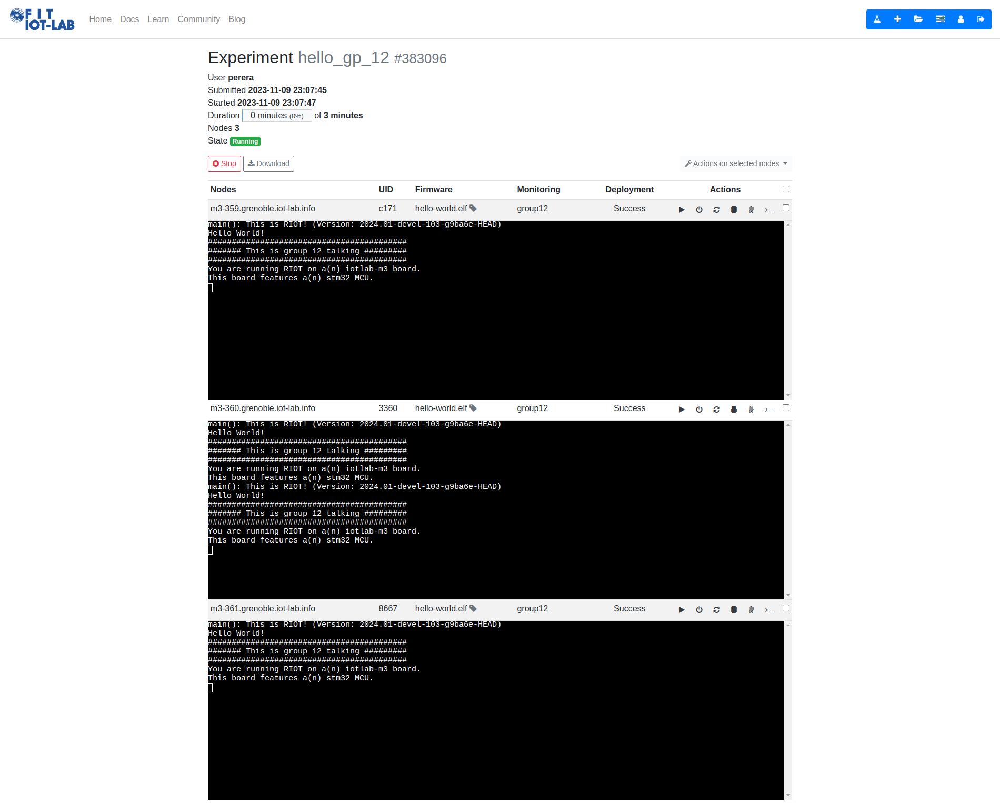

# How to run hello world example

Login to IoT Testbed ssh front end. ([SSH access · FIT IoT-LAB](https://www.iot-lab.info/docs/getting-started/ssh-access/)) 
Next clone the repository

```Bash
git clone https://github.com/KRVPerera/sense.git
cd sense
git submodule update --init
```

Next within the sense folder run the `make hello`. This will create the firmware and schedule three nodes running the firmware. You can access them via web interface. Get a terminal from the web interface and reset the nodes to see the output.



# sense
End to end IOT system which collects sensor data and visualize on cloud


## Setup 
[Run Script · FIT IoT-LAB](https://www.iot-lab.info/docs/tools/run-script/)
[Websocket client · FIT IoT-LAB](https://www.iot-lab.info/docs/tools/websocket-client/)
[Serial aggregator · FIT IoT-LAB](https://www.iot-lab.info/docs/tools/serial-aggregator/)
	- python script available

## Sensor Layer

### Sensors

#### M3 - [IoT-LAB M3 · FIT IoT-LAB](https://www.iot-lab.info/docs/boards/iot-lab-m3/)
4 sensors connected to the MCU via the **I2C** bus are embedded into the IoT-LAB M3 board:

- the **light** sensor: this measures ambient light intensity in lux.  [ISL29020](https://www.iot-lab.info/assets/misc/docs/iot-lab-m3/ISL29020.pdf)
	[ISL29020 light sensor driver](https://doc.riot-os.org/group__drivers__isl29020.html)
	
- the **pressure** and **temperature** sensor: this measures atmospheric pressure in hPa.  [LPS331AP](https://www.iot-lab.info/assets/misc/docs/iot-lab-m3/LPS331AP.pdf)
	[LPS331AP/LPS25HB/LPS22HB Pressure Sensors Driver](https://doc.riot-os.org/group__drivers__lpsxxx.html)
- the **accelerometer/magnetometer**: this provides feedback on an object’s acceleration, and can be used to detect movement. By determining a threshold, it generates a change of state on one of the MCU’s digital inputs/outputs in order to create an interrupt, which can be used to bring the MCU out of standby mode.  [LSM303DLHC](https://www.iot-lab.info/assets/misc/docs/iot-lab-m3/LSM303DLHC.pdf)
	[LSM303DLHC 3D accelerometer/magnetometer driver](https://doc.riot-os.org/group__drivers__lsm303dlhc.html)
- the **gyroscope**: this measures the orientation of an object in space and can be used, for example, to determine the orientation of the screen of a tablet or a smartphone.  [L3G4200D](https://www.iot-lab.info/assets/misc/docs/iot-lab-m3/L3G4200D.pdf)
	[L3G4200D gyroscope driver](https://doc.riot-os.org/group__drivers__l3g4200d.html)
	

#### Board - # Nordic [Nordic nRF52840DK · FIT IoT-LAB](https://www.iot-lab.info/docs/boards/nordic-nrf52840dk/) -
- temperature and humidity sensor - [HTS221](https://www.st.com/resource/en/datasheet/hts221.pdf)
	[ST HTS221 digital Humidity Sensor driver](https://doc.riot-os.org/group__drivers__hts221.html)
- an atmospheric pressure sensor  [LPS22HB](https://www.st.com/resource/en/datasheet/dm00140895.pdf)
	[LPS331AP/LPS25HB/LPS22HB Pressure Sensors Driver](https://doc.riot-os.org/group__drivers__lpsxxx.html)
- an accelerometer sensor  [LSM6DSL](https://www.st.com/resource/en/datasheet/lsm6dsl.pdf)
	[LSM6DSL 3D accelerometer/gyroscope driver](https://doc.riot-os.org/group__drivers__lsm6dsl.html)
- an accelerometer sensor  [LSM303AGR](https://www.st.com/resource/en/datasheet/lsm303agr.pdf)
	[LSM303AGR 3D accelerometer/magnetometer driver](https://doc.riot-os.org/group__drivers__lsm303agr.html)

#### ST B-L475E-IOT01A - [ST B-L475E-IOT01A · FIT IoT-LAB](https://www.iot-lab.info/docs/boards/st-b-l475e-iot01a/)

- temperature and humidity sensor - [HTS221](https://www.st.com/resource/en/datasheet/hts221.pdf)
	[ST HTS221 digital Humidity Sensor driver](https://doc.riot-os.org/group__drivers__hts221.html)
- an atmospheric pressure sensor  [LPS22HB](https://www.st.com/resource/en/datasheet/dm00140895.pdf)
	[LPS331AP/LPS25HB/LPS22HB Pressure Sensors Driver](https://doc.riot-os.org/group__drivers__lpsxxx.html)
- an accelerometer sensor  [LSM6DSL](https://www.st.com/resource/en/datasheet/lsm6dsl.pdf)
	[LSM6DSL 3D accelerometer/gyroscope driver](https://doc.riot-os.org/group__drivers__lsm6dsl.html)


## Network Layer

### Websocket 
### Publish Subscriber channel - phase 2
[MQTT · FIT IoT-LAB](https://www.iot-lab.info/docs/tools/mqtt-broker/)

### Test server

### Deployment server

AWS

## Data 

>[!WARNING]
>not sure if accelerometer, gyroscopes have a meaning. 
>I can see some boards may be connected to robots or moving platforms.. But not sure if we have access to those yet.

#### Sensor data
- temperature
- humidity
- atmospheric pressure