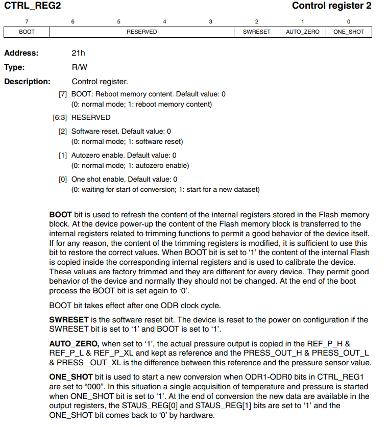
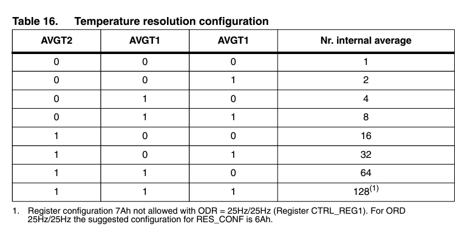

[![Contributors][contributors-shield]][contributors-url]
[![Forks][forks-shield]][forks-url]
[![Issues][issues-shield]][issues-url]
[![MIT License][license-shield]][license-url]

<a name="readme-top"></a>

<!-- PROJECT LOGO -->
<br />
<div align="center">
  <a href="https://github.com/KRVPerera/sense/blob/main/README.md">
    
  </a>

  <h3 align="center">Sense</h3>

  <p align="center">
    Sensor to Cloud - CoAP enabled system
    <br />
    <a href="https://github.com/KRVPerera/sense"><strong>Explore the docs »</strong></a>
    <br />
    <br />
    <a href="https://www.youtube.com/watch?v=Y-Kq7G6Sz5Q">View Demo</a>
    ·
    <a href="https://github.com/KRVPerera/sense/issues">Report Bug</a>
    ·
    <a href="https://github.com/KRVPerera/sense/issues">Request Feature</a>
  </p>
</div>

<!-- TABLE OF CONTENTS -->
<details>
  <summary>Table of Contents</summary>
  <ol>
    <li>
      <a href="#about-the-project">About The Project</a>
      <ul>
      <li><a href="#high-level-architecture">High Level Architecture</a></li>
      <li><a href="#sensor-layer">Sensor Layer</a></li>
      <li><a href="#network-layer">Network Layer</a></li>
      <li><a href="#data-management-layer">Data Management Layer</a></li>
      <li><a href="#overview-of-data-flow">Overview of Data Flow</a></li>
      <li><a href="#security">Security</a></li>
      <li><a href="#built-with">Built With</a></li>
      </ul>
    </li>
    <li>
      <a href="#getting-started">Getting Started</a>
      <ul>
        <li><a href="#prerequisites">Prerequisites</a></li>
        <li><a href="#installation">Installation</a></li>
        <ul>
          <li><a href="#server-side">Server side</a></li>
          <li><a href="#testbed-side">Testbed side</a></li>
        </ul>
        <li><a href="#how-to-run-the-project">How to run the project</a></li>
      </ul>
    </li>
    <li><a href="#roadmap">Roadmap</a></li>
    <li><a href="#Documentation">Documentation</a></li>
      <ul>
            <li><a href="#sensor-layer-detailed-informaton">Sensor Layer Detailed Informaton</a></li>
      </ul>
    <li><a href="#license">License</a></li>
    <li><a href="#contact">Contact</a></li>
    <li><a href="#acknowledgments">Acknowledgments</a></li>
  </ol>
</details>

## About The Project

### High Level Architecture


### Sensor Layer

More details about sensor layer is here : <li><a href="#sensor-layer-detailed-informaton">Sensor Layer Detailed Informaton | Sense</a></li>

- We using M3 boards pressure sensors built in temperature sensor to read temperature data
- Sensor is setup to temperature resolution configuration 101. To Further reduce noise and increase precision by internal averaging. (AVGT2, AVGT1, ABGT0) - 101
- We use **SMA** (Simple Moving Average) technique to reduce noise in the data
- Data is collected and send in bulk to the server
- Board is in **sleep** mode when not reading the sensor data
- Parity bit is added as extra precaution to recognize corrupted data

<p align="right">(<a href="#readme-top">back to top</a>)</p>

### Network Layer

More details about network layer is here : [docs/Network](./docs/NETWORK.md)

- We use CoAP request response style application layer protocol.
- CoAP is a **low overhead** protocol designed for **constrained** network nodes.
- It has **Confirmable** mode message communication with server that we use which gets a `ACK` response from the server.
- It provides **re transmission** to mitigate packet loss during transmission. It has a 16 bit message id to help this.
- Runs on UDP protocol reducing overhead on nodes.
- Since it runs on UDP it can intermittently connect and disconnect which by nature of IOT nodes

References

- [The Constrained Application Protocol (CoAP)](https://datatracker.ietf.org/doc/html/rfc7252)
- [Constrained Application Protocol - Wikipedia](https://en.wikipedia.org/wiki/Constrained_Application_Protocol)
- [What is CoAP](https://www.radware.com/security/ddos-knowledge-center/ddospedia/coap/)

<p align="right">(<a href="#readme-top">back to top</a>)</p>

### Data Management Layer

More details about data management layer is here : [docs/Server](./docs/SERVER.md)

- InfluxDB serves as the core Time Series Database (TSDB) in this architecture. It is a NoSQL database optimized for handling time-stamped data efficiently.
- Grafana complements InfluxDB by providing powerful visualization capabilities for time-series data.
- To ensure data integrity, a parity bit is appended to each temperature value during transmission. The EC2 CoAP listener, running as a Docker container, extracts the received data and performs frequent parity checks.

### Overview of Data Flow

1. **Data Ingestion:**
   CoAP data is ingested into the EC2 instance, where the CoAP listener Docker container captures and extracts the temperature values along with parity bits.
2. **Data Storage:**
   Extracted and verified data, is written into InfluxDB for persistent storage.
3. **Data Visualization:**
   Grafana connects to InfluxDB to fetch time-series data and displays it through customizable dashboards.

The integration of InfluxDB and Grafana within the EC2 environment provides a robust foundation for handling, storing, and visualizing time-series data efficiently.

References

- [NoSQL Database - InfluxDB](https://www.influxdata.com/glossary/nosql-database/)

<p align="right">(<a href="#readme-top">back to top</a>)</p>

### Security

- Although we have not focused on this aspect. CoAP protocol it self support secure communication over DTLS by exchanging ECDSA certificates. It is an easy to setup.
- For testing purposes we have opened all the source IPv6 addresses in EC2 instance. but we need to add inbound rules only to allow our CoAP client IPs to reach the server.
- We have made sure only the relevant port for CoAP to open in the server.
- Parity bit serves as data corruption detection. But we can go for CRC like more advance algorithms.
- Data is not encrypted. Even when you use DTLS still from application layer your server and node can decide on a encryption mechanism to secure the data further.

<p align="right">(<a href="#readme-top">back to top</a>)</p>

<!-- BUILT WITH -->

### Built With

* [RIOT - Real Time operating system](https://www.riot-os.org/)
* [IoT-LAB M3 · FIT IoT-LAB](https://www.iot-lab.info/docs/boards/iot-lab-m3/) MCU boards
* [I2C Protocol](https://en.wikipedia.org/wiki/I%C2%B2C)
* [CoAP - Constrained Application Protocol](https://en.wikipedia.org/wiki/Constrained_Application_Protocol) - Constrained Application Protocol
* [![Grafana][Grafana]][Grafana-url]
* [![InfluxDB][InfluxDB]][InfluxDB-url]
* [![Amazon EC2][AWS]][AWS-url]
* [![Docker][Docker]][Docker-url]

    <p align="right">(<a href="#readme-top">back to top</a>)</p>

## Getting Started

### Prerequisites

Test bed,

- You need an account in [FIT IoT Testbed](https://www.iot-lab.info/)
- Get SSH access. [SSH Access : FIT IoT Testbed](https://www.iot-lab.info/docs/getting-started/ssh-access/)
- For firstime use of command line tools you need authentication `iotlab-auth -u <login>`
- Next we recommend to follow our hello example [How to Run Hello | Sense Wiki](https://github.com/KRVPerera/sense/wiki/Running-our-Hello-world-in-F-I-T-IOT%E2%80%90LAB).

Server,

- Server with IPv6 stack and public IPv6 address. This is because RIOT OS only has IPv6 stack support by the time we did this project.

References,

- [Design | FIT IoT Testbed](https://www.iot-lab.info/docs/getting-started/design/)
- [Sense Wiki](https://github.com/KRVPerera/sense/wiki)

<p align="right">(<a href="#readme-top">back to top</a>)</p>

### Installation

#### Server side

Following the below guide you will be setting up the server. Below are the points we are goint to address.

- Docker installation
- InfluxDB installation
- Grafana installation
- Running CoAP server using docker

More details server setup is here : [docs/Server](https://github.com/KRVPerera/sense/blob/main/docs/SERVER.md)

<p align="right">(<a href="#readme-top">back to top</a>)</p>

#### Testbed side

Testbed already has relevant environment and tool and our make command `make run_mini_project_1` will completely run the sensor layer once you properly set it up according the section below.

If you already tried our [How to Run Hello | Sense Wiki](https://github.com/KRVPerera/sense/wiki/Running-our-Hello-world-in-F-I-T-IOT%E2%80%90LAB) example you can skip 1-5

1. Clone the repo ideally to the home folder in an SSH from end of the IOT test bed
2. If this is your first time, you have to authenticate using `iotlab-auth` command
3. Run this command in the sense folder to get RIOT. `git submodule update --init`
4. Change the site here (SENSE_SITE) in [setup_env.sh#L4 | Sense](https://github.com/KRVPerera/sense/blob/main/scripts/setup_env.sh#L4). Without running the system from the same site we cannot ssh directly into nodes.
5. Border router IP.

    - We are automatically assigning this according the site name you provided in above point 4.
    - But you can do it manually as well.Change the boarder router IP here (BORDER_ROUTER_IP) in [setup_env.sh | Sense](https://github.com/KRVPerera/sense/blob/27b935a44a8a17de54a6b4f463ea0e086fbcb665/scripts/setup_env.sh#L70) according to [IPv6 | FIT IoT Testbed](https://www.iot-lab.info/docs/getting-started/ipv6/)

6. Set the CoAP server IP (amazon in our case) in the terminal using `export COAP_SERVER_IP="[2001:660:4403:497:a417:1216:7ea7:9acb]:5683"`. How to setup the server is explained in our docs [docs/Server.](https://github.com/KRVPerera/sense/blob/4340af737ee8b608d5924ff08c33486e86bc59cc/docs/SERVER.md)
7. Run the command `make run_mini_project_1` from the sense home directory.
8. If the default nodes are busy, change the initial node number here [setup_env.sh#L29 | Sense](https://github.com/KRVPerera/sense/blob/27b935a44a8a17de54a6b4f463ea0e086fbcb665/scripts/setup_env.sh#L29)

> [!TIP]
> Our demo video can be a hand one experience setup for you here [IoT mini project Group 12 | Youtube](https://youtu.be/Y-Kq7G6Sz5Q) video.

<p align="right">(<a href="#readme-top">back to top</a>)</p>

### How to run the project

If the server is ready and everything is setup correctly,
Run the command `make run_mini_project_1` from the sense home directory. You will start to see receving data from the server (coap server -> database -> grafana)

<p align="right">(<a href="#readme-top">back to top</a>)</p>

<!-- DOCUMENTATION -->

## Documentation
<a name="documentation-top"></a>

### Sensor Layer Detailed Informaton

- [IoT Lab M3 board](#iot-lab-m3-board-architecture)
- [Noise in Data](#noise-in-temperature-readings)
- [Noise Handling](#noise-reduction-technique-we-used)
- [Data Resilience](#data-resilience)
- [Power optimization](#power-optimization)
- [Sensor Calibration](#calibration)

<p align="right">(<a href="#readme-top">back to top</a>)</p>

In this project we use iot-lab m3 boards provided by FIT IOT-LAB which has 4 different types of sensors mounted to it. They are,

- The **light** sensor (ISL29020): This measures ambient light intensity in lux.  
  
  - [ISL29020](https://www.iot-lab.info/assets/misc/docs/iot-lab-m3/ISL29020.pdf)
  
  - [ISL29020 light sensor driver](https://doc.riot-os.org/group__drivers__isl29020.html)

- The **pressure** and **temperature** sensor (LPS331AP): This measures atmospheric pressure in hPa.  
  
  - [LPS331AP](https://www.iot-lab.info/assets/misc/docs/iot-lab-m3/LPS331AP.pdf)
  - [LPS331AP/LPS25HB/LPS22HB Pressure Sensors Driver](https://doc.riot-os.org/group__drivers__lpsxxx.html)

- The **accelerometer/magnetometer** (LSM303DLHC): This provides feedback on an object’s acceleration, and can be used to detect movement. By determining a threshold, it generates a change of state on one of the MCU’s digital inputs/outputs in order to create an interrupt, which can be used to bring the MCU out of standby mode.  
  
  - [LSM303DLHC](https://www.iot-lab.info/assets/misc/docs/iot-lab-m3/LSM303DLHC.pdf)
  - [LSM303DLHC 3D accelerometer/magnetometer driver](https://doc.riot-os.org/group__drivers__lsm303dlhc.html)

- The **gyroscope** (L3G4200D): This measures the orientation of an object in space and can be used, for example, to determine the orientation of the screen of a tablet or a smartphone.  
  
  - [L3G4200D](https://www.iot-lab.info/assets/misc/docs/iot-lab-m3/L3G4200D.pdf)
  - [L3G4200D gyroscope driver](https://doc.riot-os.org/group__drivers__l3g4200d.html)

<p align="right">
  (<a href="#documentation-top"> Documentation</a> |
  <a href="#readme-top"> Top </a>)
</p>

In our project we used only the LPS331AP sensor to measure temperature values.

### IOT-LAB M3 board architecture


More details about IOT-LAB M3 board can be found here:  [IoT-LAB M3 · FIT IoT-LAB](https://www.iot-lab.info/docs/boards/iot-lab-m3/)

<p align="right">
  (<a href="#documentation-top"> Documentation</a> |
  <a href="#readme-top"> Top </a>)
</p>

### Noise in temperature readings

Noise in sensor readings refers to unwanted or random variations in the data collected by sensors. This noise can be caused by various factors and can have a significant impact on the accuracy and reliability of the sensor readings. Here are some common sources of noise in IoT sensor data.

- Environment factors.

- Fluctuations in the power supply to the sensors can result in variations in the sensor readings.

- Over time, sensors may degrade or drift, leading to changes in their performance and introducing noise into the readings.

- Issues in signal processing or during data transmission can introduce noise into the sensor readings. This could be due to poor quality communication channels or interference during data transmission.

- External electromagnetic fields or radio frequency signals can interfere with the signals from sensors, leading to inaccurate readings.

<p align="right">
  (<a href="#documentation-top"> Documentation</a> |
  <a href="#readme-top"> Top </a>)
</p>

### Noise reduction technique we used

To eliminate those noises we implemented moving averaging filtering method.

Moving average filtering is a common technique used in signal processing and data analysis to smooth out fluctuations or noise in a time series data set. It is particularly useful in situations where the data contains random variations that may obscure underlying trends or patterns. Moving average filtering works by calculating the average of a set of consecutive data points over a specified window or period, and this average value is then used to represent the smoothed data. 

There are different variations of moving averages, including:

- **Simple Moving Average (SMA):** All data points in the window are given equal weight. (In our project we used this method)

- **Weighted Moving Average (WMA):** Assigns different weights to different data points within the window, giving more importance to certain points.

- **Exponential Moving Average (EMA):** Gives more weight to recent data points and less weight to older data points, allowing for a quicker response to changes in the data.

In our project we used Simple Moving Average Method with window size equal to 5.

[Moving average method implementation](https://github.com/KRVPerera/sense/blob/d57dd8540bc15ae0ad9e885204da4558fc1d42b5/src/sensor/sensor-connected/main.c#L159C7-L180C1)

<p align="right">
  (<a href="#documentation-top"> Documentation</a> |
  <a href="#readme-top"> Top </a>)
</p>

### Data Resilience

To ensure that the exact data we sent received to the server, we used a parity bit after the each temperature value. When the data is received by the CoAP cloud server, the server extracts the data, including the parity bit assigned to each temperature value. The server then performs a parity check, verifying the integrity of each temperature value. If a discrepancy is detected, indicating that the data has been corrupted during transmission, the server average out the corrupted data to ensure the accuracy and reliability of the received information.

### Parity bit

There are two common types of parity:

1. **Even Parity:**
   
   - In even parity, the total number of bits set to 1 in a given set of bits, including the parity bit, is made even.
   - If the number of 1s is already even, the parity bit is set to 0. If the number of 1s is odd, the parity bit is set to 1.

2. **Odd Parity:**
   
   - In odd parity, the total number of bits set to 1 is made odd.
   - If the number of 1s is already odd, the parity bit is set to 0. If the number of 1s is even, the parity bit is set to 1.

In our project we have used odd parity.

[Parity bit calculator](https://github.com/KRVPerera/sense/blob/d57dd8540bc15ae0ad9e885204da4558fc1d42b5/src/sensor/sensor-connected/main.c#L118C1-L132C2)

<p align="right">
  (<a href="#documentation-top"> Documentation</a> |
  <a href="#readme-top"> Top </a>)
</p>

### Power optimization

- In our project, the communication between the sensor and the processor is facilitated through the utilization of the I2C interface in a low-power mode. 

- Also, To conserve energy, we employ the sleep method from the ztimer module during periods when temperature values are not being sensed.

- To further optimize power consumption, we have implemented a strategy where individual temperature values are not immediately sent to the server, as this process tends to be energy-intensive due to networking operations. Instead, we have implemented a buffering mechanism, capturing and storing 10 temperature values at one-second intervals. Once the buffer reaches a capacity of 10 values, we initiate the transmission of this batch to the server via a border router, utilizing the CoAP protocol. This approach helps minimize power usage during communication and contributes to the overall energy efficiency of the system.

<p align="right">
  (<a href="#documentation-top"> Documentation</a> |
  <a href="#readme-top"> Top </a>)
</p>

### Calibration

Sensor needed some setup to work properly. In IOT test bed examples they initialize the sensor and reads data. But that code is not properly written and sensor needs to be reset to work in properly to get good enough data.

<p align="right">
  (<a href="#documentation-top"> Documentation</a> |
  <a href="#readme-top"> Top </a>)
</p>

- **Initialization**
  
  Init function can fail. Even I2C communication fail may also be there and it needs to be captured. Since we don't read data faster we setup the sensor to work in `7Hz` mode. Sensor supports 7,12 and 25Hz(with some penalties).
  
  ```c
   lpsxxx_params_t paramts = {
        .i2c = lpsxxx_params[0].i2c,
        .addr = lpsxxx_params[0].addr,
        .rate = LPSXXX_RATE_7HZ};
  
  if (lpsxxx_init(&lpsxxx, &paramts) != LPSXXX_OK)
    {
      puts("Sensor initialization failed");
      return 0;
    }
  ```

- **Sensor reset**
  Sensor is reset to remove any garbage values in its DSPs and to properly initialize the sensor
  
  ```c
    // 7       6543    2          1      0
    // BOOT RESERVED SWRESET AUTO_ZERO ONE_SHOT
    //  1      0000   1      0            0
    // 44
    if (temp_sensor_write_CTRL_REG2_value(&lpsxxx, 0x44) != LPSXXX_OK)
    {
      puts("Sensor reset failed");
      return 0;
    }
  ```
  
  

  <p align="right">
  (<a href="#documentation-top"> Documentation</a> |
  <a href="#readme-top"> Top </a>)
</p>

  - **Temperature Resolution**
  Resolution is set to 16 (AVGT2 AVGT1 AVGT0 100) to set the precision of temperature data according to our application.

  This reduces noise by internal averaging. Maximum value is not needed for us. It consumes more power.
  
  ```c
    // 0x40 -- 01000000
    // AVGT2 AVGT1 AVGT0 100 --  Nr. internal average : 16
    if (temp_sensor_write_res_conf(&lpsxxx, 0x40) != LPSXXX_OK)
    {
      puts("Sensor enable failed");
      return 0;
    }
  ```




  - **Wait for sensor to stabalize**
  
  ```c
     ztimer_sleep(ZTIMER_MSEC, 5000);
  ```

<p align="right">
  (<a href="#documentation-top"> Documentation</a> |
  <a href="#readme-top"> Top </a>)
</p>

- Helper functions

We wrote some helper functions. There may already be functions provided by RIOT but due to time limitation we wrote our own.

```c
int write_register_value(const lpsxxx_t *dev, uint16_t reg, uint8_t value)
{
  i2c_acquire(DEV_I2C);
  if (i2c_write_reg(DEV_I2C, DEV_ADDR, reg, value, 0) < 0)
  {
    i2c_release(DEV_I2C);
    return -LPSXXX_ERR_I2C;
  }
  i2c_release(DEV_I2C);

  return LPSXXX_OK; // Success
}

int temp_sensor_write_CTRL_REG2_value(const lpsxxx_t *dev, uint8_t value)
{
  return write_register_value(dev, LPSXXX_REG_CTRL_REG2, value);
}

int temp_sensor_write_res_conf(const lpsxxx_t *dev, uint8_t value)
{
  return write_register_value(dev, LPSXXX_REG_RES_CONF, value);
}
```

References

- https://www.iot-lab.info/assets/misc/docs/iot-lab-m3/LPS331AP.pdf

<p align="right">
  (<a href="#documentation-top"> Documentation</a> |
  <a href="#readme-top"> Top </a>)
</p>


[docs/NETWORK](docs/NETWORK.md)

[docs/SERVER](docs/SERVER.md)

[docs/COMPRESSION](docs/COMPRESSION.md)

<!-- LICENSE -->

## License

Distributed under the MIT License. See `LICENSE.txt` for more information.

<p align="right">(<a href="#readme-top">back to top</a>)</p>

<!-- ACKNOWLEDGMENTS -->

## Acknowledgments

-   [Choose an Open Source License](https://choosealicense.com)
-   [Awesome Badges](https://dev.to/envoy_/150-badges-for-github-pnk)
-   [Best README Template](https://github.com/othneildrew/Best-README-Template)

<p align="right">(<a href="#readme-top">back to top</a>)</p>

<!-- MARKDOWN LINKS & IMAGES -->
<!-- https://www.markdownguide.org/basic-syntax/#reference-style-links -->

[contributors-shield]: https://img.shields.io/github/contributors/KRVPerera/sense.svg?style=plastic
[contributors-url]: https://github.com/KRVPerera/sense/graphs/contributors
[forks-shield]: https://img.shields.io/github/forks/KRVPerera/sense.svg?style=plastic
[forks-url]: https://github.com/KRVPerera/sense/network/members
[issues-shield]: https://img.shields.io/github/issues/KRVPerera/sense.svg?style=plastic
[issues-url]: https://github.com/KRVPerera/sense/issues
[license-shield]: https://img.shields.io/github/license/KRVPerera/sense.svg?style=plastic
[license-url]: https://github.com/KRVPerera/sense/blob/master/LICENSE.txt

[React.js]: https://img.shields.io/badge/React-20232A?style=for-the-badge&logo=react&logoColor=61DAFB
[React-url]: https://reactjs.org/
[InfluxDB]: https://img.shields.io/badge/InfluxDB-22ADF6?style=for-the-badge&logo=InfluxDB&logoColor=white
[InfluxDB-url]: https://www.influxdata.com/glossary/nosql-database/

[AWS]: https://img.shields.io/badge/AWS-%23FF9900.svg?style=for-the-badge&logo=amazon-aws&logoColor=white
[AWS-url]: https://aws.amazon.com/ec2/

[Grafana]: https://img.shields.io/badge/grafana-blue?style=for-the-badge
[Grafana-url]: https://grafana.com/


[Docker]: https://img.shields.io/badge/docker-%230db7ed.svg?style=for-the-badge&logo=docker&logoColor=white
[Docker-url]: https://www.docker.com/