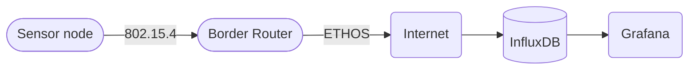
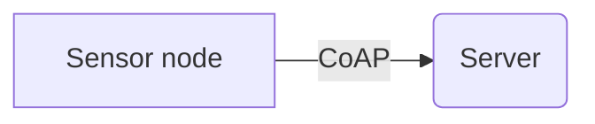

# Network

Our project uses IPv6 (TCP/IP) stack for connectivity between nodes and connectivity to our server which handles most of the data.

## Simple Architecture

Sensor node is connected to to internet via border router. We are writing a guide how to setup the border router with our setup.

## CoAP protocol for application layer

- We send each in ´Confirmable´ mode

- 

## References

- [CoAP server with public IPv6 network on M3 nodes · FIT IoT-LAB](https://www.iot-lab.info/learn/tutorials/riot/riot-coap-m3/)

- [Constrained Application Protocol - Wikipedia](https://en.wikipedia.org/wiki/Constrained_Application_Protocol)

- 
