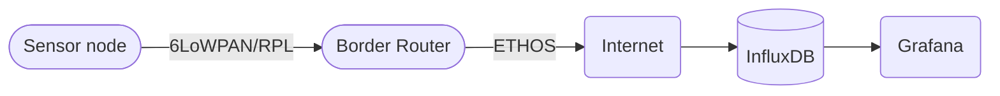
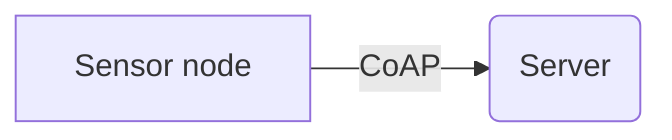

# Network

Our project uses IPv6 (TCP/IP) stack for connectivity between nodes and connectivity to our server which handles most of the data.

 diagram, 

## Architecture

Sensor node is connected to to internet via border router. We are writing a separate guide how to setup the border router with our setup.

## Link Layer

This project is implemented using [IoT-LAB M3]([IoT-LAB M3 · FIT IoT-LAB](https://www.iot-lab.info/docs/boards/iot-lab-m3/)) mcu boards and they have [AT86RF231](https://www.iot-lab.info/assets/misc/docs/iot-lab-m3/AT86RF231.pdf) radio chip. Radio chip is designed for `IEEE 802.15.4 (LR-WPAN)` standard (Low-rate wireless personal area networks). 

**6LoWPAN** (IPv6 over Low-Power Wireless Personal Area Network)

Provides neighbor discovery, header compression like features and it is designed for low power devices with limiting processing capabilities.

 

##### References

[IEEE 802.15.4 - Wikipedia](https://en.wikipedia.org/wiki/IEEE_802.15.4#:~:text=4%20is%20a%20technical%20standard,defined%20the%20standard%20in%202003.)

## CoAP protocol for application layer

- We send each in ´Confirmable´ mode

How CoAP impo

Retransmission

Why CoAP

    server/client

## References

- [CoAP server with public IPv6 network on M3 nodes · FIT IoT-LAB](https://www.iot-lab.info/learn/tutorials/riot/riot-coap-m3/)

- [Constrained Application Protocol - Wikipedia](https://en.wikipedia.org/wiki/Constrained_Application_Protocol)

- 
