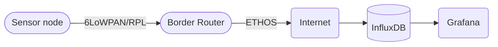

# Network

Our project uses IPv6 (TCP/IP) stack for connectivity between nodes and connectivity to our server which handles most of the data.

 diagram, 

## Architecture

Sensor node is connected to to internet via border router. We are writing a separate guide how to setup the border router with our setup.

## Link Layer

This project is implemented using [IoT-LAB M3]([IoT-LAB M3 · FIT IoT-LAB](https://www.iot-lab.info/docs/boards/iot-lab-m3/)) mcu boards and they have [AT86RF231](https://www.iot-lab.info/assets/misc/docs/iot-lab-m3/AT86RF231.pdf) radio chip. Radio chip is designed for `IEEE 802.15.4 (LR-WPAN)` standard (Low-rate wireless personal area networks). 

**6LoWPAN** (IPv6 over Low-Power Wireless Personal Area Network)

Provides neighbor discovery, header compression like features and it is designed for low power devices with limiting processing capabilities.

 **RPL** (Routing protocol for low power and lossy networks)

RPL is an IPv6-based routing protocol designed for energy-efficient communication in low-power and resource-constrained networks, commonly used in the Internet of Things (IoT) and industrial settings.

### References

- [IEEE 802.15.4 - Wikipedia](https://en.wikipedia.org/wiki/IEEE_802.15.4#:~:text=4%20is%20a%20technical%20standard,defined%20the%20standard%20in%202003.)

- [6LoWPAN - Wikipedia](https://en.wikipedia.org/wiki/6LoWPAN)

- [RPL - Wikipedia](https://en.wikipedia.org/wiki/IPv6_Routing_Protocol_for_Low-Power_and_Lossy_Networks)

## CoAP protocol for application layer

The Constrained Application Protocol (CoAP) is a lightweight and efficient communication protocol designed for resource-constrained devices in the Internet of Things (IoT). It operates over UDP and enables simple, low-power devices to exchange information in a RESTful manner.

We send each messsage in ´Confirmable´ mode.

## References

- [CoAP server with public IPv6 network on M3 nodes · FIT IoT-LAB](https://www.iot-lab.info/learn/tutorials/riot/riot-coap-m3/)

- [Constrained Application Protocol - Wikipedia](https://en.wikipedia.org/wiki/Constrained_Application_Protocol)

- [The Constrained Application Protocol (CoAP)](https://datatracker.ietf.org/doc/html/rfc7252)

- [What is CoAP](https://www.radware.com/security/ddos-knowledge-center/ddospedia/coap/)
