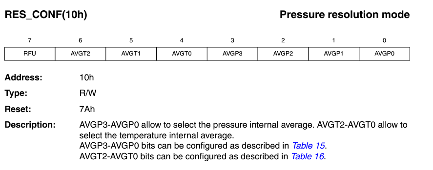

# Sensor Layer

- [IoT Lab M3 board](#iot-lab-m3-board-architecture)

- [Noise in Data](#noise-in-temperature-readings)

- [Noise Handling](#noise-reduction-technique-we-used)

- [Data Resilience](#data-resilience)

- [Power optimization](#power-optimization)

- [Sensor Calibration](#calibration)

In this project we use iot-lab m3 boards provided by FIT IOT-LAB which has 4 different types of sensors mounted to it. They are,

- The **light** sensor (ISL29020): This measures ambient light intensity in lux.  
  
  - [ISL29020](https://www.iot-lab.info/assets/misc/docs/iot-lab-m3/ISL29020.pdf)
  
  - [ISL29020 light sensor driver](https://doc.riot-os.org/group__drivers__isl29020.html)

- The **pressure** and **temperature** sensor (LPS331AP): This measures atmospheric pressure in hPa.  
  
  - [LPS331AP](https://www.iot-lab.info/assets/misc/docs/iot-lab-m3/LPS331AP.pdf)
  - [LPS331AP/LPS25HB/LPS22HB Pressure Sensors Driver](https://doc.riot-os.org/group__drivers__lpsxxx.html)

- The **accelerometer/magnetometer** (LSM303DLHC): This provides feedback on an object’s acceleration, and can be used to detect movement. By determining a threshold, it generates a change of state on one of the MCU’s digital inputs/outputs in order to create an interrupt, which can be used to bring the MCU out of standby mode.  
  
  - [LSM303DLHC](https://www.iot-lab.info/assets/misc/docs/iot-lab-m3/LSM303DLHC.pdf)
  - [LSM303DLHC 3D accelerometer/magnetometer driver](https://doc.riot-os.org/group__drivers__lsm303dlhc.html)

- The **gyroscope** (L3G4200D): This measures the orientation of an object in space and can be used, for example, to determine the orientation of the screen of a tablet or a smartphone.  
  
  - [L3G4200D](https://www.iot-lab.info/assets/misc/docs/iot-lab-m3/L3G4200D.pdf)
  - [L3G4200D gyroscope driver](https://doc.riot-os.org/group__drivers__l3g4200d.html)

In our project we used only the LPS331AP sensor to measure temperature values.

## IOT-LAB M3 board architecture


More details about IOT-LAB M3 board can be found here:  [IoT-LAB M3 · FIT IoT-LAB](https://www.iot-lab.info/docs/boards/iot-lab-m3/)

## Noise in temperature readings

Noise in sensor readings refers to unwanted or random variations in the data collected by sensors. This noise can be caused by various factors and can have a significant impact on the accuracy and reliability of the sensor readings. Here are some common sources of noise in IoT sensor data.

- Environment factors.

- Fluctuations in the power supply to the sensors can result in variations in the sensor readings.

- Over time, sensors may degrade or drift, leading to changes in their performance and introducing noise into the readings.

- Issues in signal processing or during data transmission can introduce noise into the sensor readings. This could be due to poor quality communication channels or interference during data transmission.

- External electromagnetic fields or radio frequency signals can interfere with the signals from sensors, leading to inaccurate readings.

## Noise reduction technique we used

To eliminate those noises we implemented moving averaging filtering method.

Moving average filtering is a common technique used in signal processing and data analysis to smooth out fluctuations or noise in a time series data set. It is particularly useful in situations where the data contains random variations that may obscure underlying trends or patterns. Moving average filtering works by calculating the average of a set of consecutive data points over a specified window or period, and this average value is then used to represent the smoothed data. 

There are different variations of moving averages, including:

- **Simple Moving Average (SMA):** All data points in the window are given equal weight. (In our project we used this method)

- **Weighted Moving Average (WMA):** Assigns different weights to different data points within the window, giving more importance to certain points.

- **Exponential Moving Average (EMA):** Gives more weight to recent data points and less weight to older data points, allowing for a quicker response to changes in the data.

In our project we used Simple Moving Average Method with window size equal to 5.

[Moving average method implementation](https://github.com/KRVPerera/sense/blob/d57dd8540bc15ae0ad9e885204da4558fc1d42b5/src/sensor/sensor-connected/main.c#L159C7-L180C1)

## Data Resilience

To ensure that the exact data we sent received to the server, we used a parity bit after the each temperature value. When the data is received by the CoAP cloud server, the server extracts the data, including the parity bit assigned to each temperature value. The server then performs a parity check, verifying the integrity of each temperature value. If a discrepancy is detected, indicating that the data has been corrupted during transmission, the server average out the corrupted data to ensure the accuracy and reliability of the received information.

### Parity bit

There are two common types of parity:

1. **Even Parity:**
   
   - In even parity, the total number of bits set to 1 in a given set of bits, including the parity bit, is made even.
   - If the number of 1s is already even, the parity bit is set to 0. If the number of 1s is odd, the parity bit is set to 1.

2. **Odd Parity:**
   
   - In odd parity, the total number of bits set to 1 is made odd.
   - If the number of 1s is already odd, the parity bit is set to 0. If the number of 1s is even, the parity bit is set to 1.

In our project we have used odd parity.

[Parity bit calculator](https://github.com/KRVPerera/sense/blob/d57dd8540bc15ae0ad9e885204da4558fc1d42b5/src/sensor/sensor-connected/main.c#L118C1-L132C2)

## Power optimization

- In our project, the communication between the sensor and the processor is facilitated through the utilization of the I2C interface in a low-power mode. 

- Also, To conserve energy, we employ the sleep method from the ztimer module during periods when temperature values are not being sensed.

- To further optimize power consumption, we have implemented a strategy where individual temperature values are not immediately sent to the server, as this process tends to be energy-intensive due to networking operations. Instead, we have implemented a buffering mechanism, capturing and storing 10 temperature values at one-second intervals. Once the buffer reaches a capacity of 10 values, we initiate the transmission of this batch to the server via a border router, utilizing the CoAP protocol. This approach helps minimize power usage during communication and contributes to the overall energy efficiency of the system.

## Calibration

Sensor needed some setup to work properly. In IOT test bed examples they initialize the sensor and reads data. But that code is not properly written and sensor needs to be reset to work in properly to get good enough data.

- **Initialization**
  
  Init function can fail. Even I2C communication fail may also be there and it needs to be captured. Since we don't read data faster we setup the sensor to work in `7Hz` mode. Sensor supports 7,12 and 25Hz(with some penalties).
  
  ```c
   lpsxxx_params_t paramts = {
        .i2c = lpsxxx_params[0].i2c,
        .addr = lpsxxx_params[0].addr,
        .rate = LPSXXX_RATE_7HZ};
  
  if (lpsxxx_init(&lpsxxx, &paramts) != LPSXXX_OK)
    {
      puts("Sensor initialization failed");
      return 0;
    }
  ```

- **Sensor reset**
  Sensor is reset to remove any garbage values in its DSPs and to properly initialize the sensor
  
  ```c
    // 7       6543    2          1      0
    // BOOT RESERVED SWRESET AUTO_ZERO ONE_SHOT
    //  1      0000   1      0            0
    // 44
    if (temp_sensor_write_CTRL_REG2_value(&lpsxxx, 0x44) != LPSXXX_OK)
    {
      puts("Sensor reset failed");
      return 0;
    }
  ```
  
  

  - **Temperature Resolution**
  Resolution is set to 16 (AVGT2 AVGT1 AVGT0 100) to set the precision of temperature data according to our application.

  This reduces noise by internal averaging. Maximum value is not needed for us. It consumes more power.
  
  ```c
    // 0x40 -- 01000000
    // AVGT2 AVGT1 AVGT0 100 --  Nr. internal average : 16
    if (temp_sensor_write_res_conf(&lpsxxx, 0x40) != LPSXXX_OK)
    {
      puts("Sensor enable failed");
      return 0;
    }
  ```




  - **Wait for sensor to stabalize**
  
  ```c
     ztimer_sleep(ZTIMER_MSEC, 5000);
  ```

- Helper functions

We wrote some helper functions. There may already be functions provided by RIOT but due to time limitation we wrote our own.

```c
int write_register_value(const lpsxxx_t *dev, uint16_t reg, uint8_t value)
{
  i2c_acquire(DEV_I2C);
  if (i2c_write_reg(DEV_I2C, DEV_ADDR, reg, value, 0) < 0)
  {
    i2c_release(DEV_I2C);
    return -LPSXXX_ERR_I2C;
  }
  i2c_release(DEV_I2C);

  return LPSXXX_OK; // Success
}

int temp_sensor_write_CTRL_REG2_value(const lpsxxx_t *dev, uint8_t value)
{
  return write_register_value(dev, LPSXXX_REG_CTRL_REG2, value);
}

int temp_sensor_write_res_conf(const lpsxxx_t *dev, uint8_t value)
{
  return write_register_value(dev, LPSXXX_REG_RES_CONF, value);
}
```

### References
- https://www.iot-lab.info/assets/misc/docs/iot-lab-m3/LPS331AP.pdf
