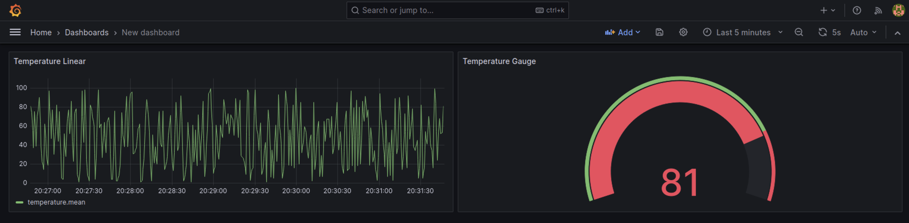

Server
============

This project implements a cloud-based solution for handling CoAP data. The server listens for CoAP data, writes it into an InfluxDB database, and visualizes the data using Grafana. The implementation utilizes Docker for easy deployment, and the entire system can be deployed on an AWS EC2 instance.

### Example view of Visualizer



### Overview of Data & Technology Flow

1. Data will ingest via CoAP into an EC2 Instance with a Static IPv6 address.
2. A python based script via Docker is run as a CoAP listener that spits the CoAP data into an InfluxDB database. 
3. Grafana is integrated with InfluxDB database and visualize the stats

### Usage

All the commands are written in shell scripts. Use the `.deploy.sh` shell script to deploy and run the server components. script snables to change the modes and build and run different components of the stack.

command:
```./deploy.sh --mode <mode-selection>```

mode-selection
1. `server` - to build and deploy the CoAP listener docker container
3. `all` - to build the whole system

### Grafana

 Grafana can be access through: `http://<public-ip>:3000/`
